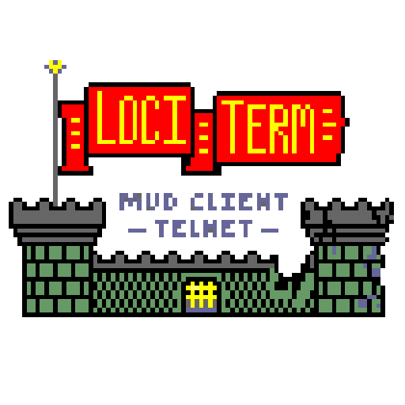
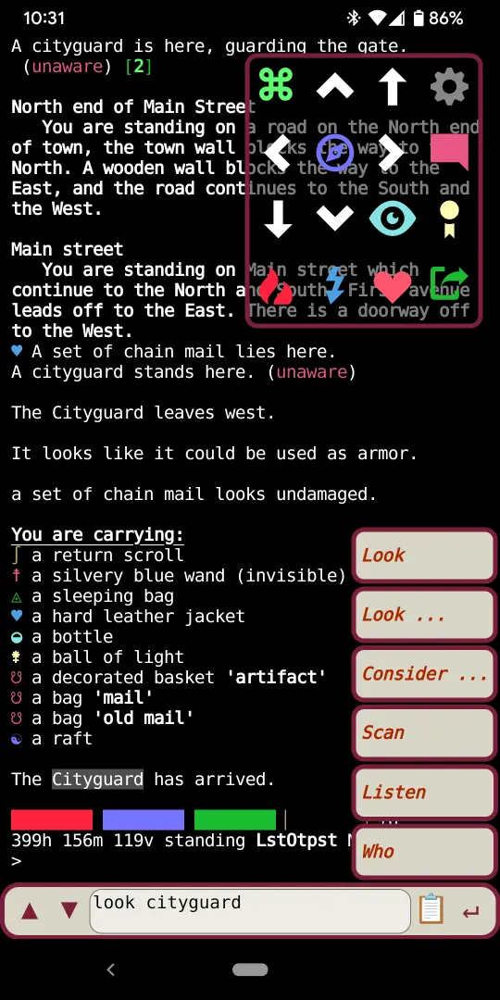

## LociTerm MUD Client Telnet

**LociTerm is a Progressive Web App that provides MUD Telnet connectivity to any platform with a JavaScript enabled Web Browser, through a hosted server component.**

## Introduction to LociTerm

Telnet is a network protocol from the early days of the Internet that allows
one computer to log into another computer.  In the 1990's, before the creation
of the World Wide Web, Telnet was ubiquitous.  Every networked computer at the
time had a Telnet Client, just as every networked computer today has a Web
Browser.     
  
MUDs ("Multi User Dungeons") are one of the first type of multi-player online
games to take advantage of the growth of the Internet in the 1990's.  They are
typically modeled after a table top RPG Dungeons and Dragons style game, with
the computer playing the role of the DM.  Because MUDs started in the text-only
Internet of the early 1990's, they were written to use the Telnet protocol for
access.  

As the Internet grew, the Telnet protocol was gradually replaced by more secure
options, and the text-only Telnet Internet was replaced by the graphically rich
Web Browser Internet.  The Telnet Client, which was once available by default
on every computer, is now increasingly difficult to install- if a Telnet Client
is available for a platform at all.

MUDs, however, live on!  There is a community of gamers who have been playing
and adding to these text only Telnet games since their inception, and still
need a Telnet Client to play them.   There are MUD Telnet clients available for
Windows, MacOS, Linux, Android and iOS, but they are typically built for those
specific operating systems, or are available on the desktop systems, but not on
the mobile ones.  

This is where LociTerm comes in!  

## What and Why of LociTerm

First and foremost, LociTerm is a Web Enabled Telnet Client with a terminal
emulator, making it more than a simple line mode MUD client with color support.    
  
There are several Web Based MUD client sites that players can use to connect to
MUD games.  Notable among them are Grapevine (<https://grapevine.haus/>) ,
MudSlinger (<https://mudslinger.net/play/>), and MudPortal
(<http://www.mudportal.com/>).  

These sites are great, but they are all line mode only MUD clients rather than
true Telnet Network Virtual Terminal emulators.  They simply don't work with
games or other services that need terminal emulation or character at a time
support.   Also, while those sites work and look great on a desktop browser for
line mode MUD games, none of them work well on a mobile platform.   They were
designed for desktop use.

LociTerm started out as a dedicated client for The Last Outpost MUD
(<https://www.last-outpost.com/>), a game that uses character mode, and is more
enjoyable to play that way.   None of the existing open web clients could do
that mode, so the **Last Outpost Client Implementation Terminal** project was
started out of necessity.

## Who and Where of LociTerm

Players: If you are just looking to use LociTerm to connect to games, there is
no need to download and build LociTerm yourself.  You should be able to connect
to an open LociTerm instance, suggest your favorite MUD, and connect to it from
there.  See [SITES.md](SITES.md) for a list of LociTerm servers.

However, if you want to avoid sending your traffic through a 3rd party LociTerm
server, you can build and run your own private local instance of LociTerm that
runs entirely on a single machine.

Mud Operators: LociTerm is a great way to add mobile connectivity for players.
LociTerm can be configured in a dedicated mode to only allow connections to
your own game, or it can be configured as an open server to allow connections
to other games in addition to your own.  You can run the server component on
the same system as the game, on your web server, or elsewhere 'in the cloud'.

## LociTerm Feature Support

- Supports Character at a Time Mode and XTERM Terminal emulation.
- Designed with a "mobile first" philosophy to enable MUDing on the go.
- Seamless support for Mobile IP address changes, so game connection stays up as client roams. 
- "Reactive Web" design with CSS, same client runs on desktop or mobile.
- "Progressive Web App" can be installed as a native-feel application on most platforms.
- User selected display themes, font and UI element sizes, menu locations
- User settings saved in local browser storage between sessions.
- Touch screen and mouse enabled.  Physical Keyboard or On Screen Keyboard with Speech to Text input on mobile platforms.
- Line mode entry with local history.
- User selected CRT emulation filters for nostalgic terminal look
- ARIA screen reader hinting support enabled by default
- End-to-end Encryption- HTTPS websocket for client-to-server, TELNET-SSL from server to games that offer ssl.
- End-to-end Compression- Websocket Per-Message Compression for client to server, MUD Client Compression Protocol for server to game
- Standard Supported Telnet Options- TTYPE, EOR, NAWS, ECHO, SGA, NEW-ENVIRON, Old Line Mode, Character-at-a-Time Mode
- MUD Telnet Options- MCCP2, MTTS, MSSP, GMCP
- GMCP Support for Char.Login, Loci.Hotkey and Loci.Menu
- Terminal support for UTF-8, Emoji, ANSI Color/256/Truecolor, fully XTERM VT compatible, Mouse tracking,  SIXEL and IIP inline graphics display.
- About Game shows server MSSP data, including Icon, location, contact info and web links.
- Local function key editor and function key menu.
- CP437 fallback for Telnet BBS systems

## How LociTerm Works

LociTerm is two programs, one that runs on a dedicated server "in the cloud",
and one that runs inside each user's web browser.   The two programs work
together to translate the Telnet protocol from a game into one that can be
displayed in the browser. 

The Server side of LociTerm is written in C, and runs under Linux.  It
implements a web server for sending the client program to the user's web
browser, and a custom WebSockets protocol (via libwebsockets) server for
talking to the client side program, a MUD Telnet client for talking to game
servers (via libtelnet), and a database component (via sqlite3) for managing a
directory of known games.  It provides service for multiple clients and games
simultaneously.

The Client side of LociTerm is written in JavaScript, and runs in a web
browser.  It implements the same WebSockets protocol as the server, runs a
terminal component (via xterm.js) that can render ANSI/XTERM data directly into
a browser window, input components that handle line or keystroke entry, and
some convenient on screen buttons and menus.

When a player connects to a game, the LociTerm client component contacts the
LociTerm server component, and the server component connects to the game.  The
server bridges the data between the game and the LociTerm client running in the
user's web browser.

## INSTALL

LociTerm requires libglib2.0-dev, ctags, openssl, cmake, libwebsockets4.4.0,
npm, libjson-c-dev.  On a Debian 12 system:

`apt-get install gcc libglib2.0-dev exuberant-ctags openssl cmake npm
libjson-c-dev libsqlite3-dev pkg-config`

Will install all of the required development packages to build LociTerm EXCEPT
libwebsockets.  The version of libwebsockets that ships with Debian 12 is not
the right version, is missing some compile time options, and so needs to be
re-built from the most up to date source.   

Once the packages are installed, running  `make` and `make install` will
install LociTerm  into the /usr/local directory.  There are additional steps
for making the terminal available under its own apache2 document root, and
having it start up automatically from systemd.  

See the file **INSTALL.txt** for those details.

Once the locid.conf file is configured with a service port and security model
(or as a forwarded host from Apache), clients will be able to connect by going
to the configured URL.  For a test system, that might look like:

`http://localhost:4500`  

For a production system with Apache port forwarding and live certificates, that
might look like:

`https://www.last-outpost.com/lociterm/`.

When the client connects to the lociterm server for the first time, it will
automatically be connected to the default game stored in the server's config
file.  If the user changes to a different game, that choice is stored on the
client side, and will be used as the user's default game whenever they launch.

Creating a URL with host, port, ssl, and menu parameters will force the client
to connect to those when the user clicks the link, overriding the last game and
menu set stored on the client system.  A forced connection URL might look like:

`https://www.last-outpost.com/lociterm/?host=www.last-outpost.com&port=4443&ssl=1&menu=lastoutpost`

This can be used to direct players to connect to a specific game that isn't the
default for a particular LociTerm server.  

(Note that the menu parameter should match the "name": of a menu, not the
"label":.  Some of the built-in menu names are, "lastputpost", "diagonal",
"telnet", and "none".  This list is subject to change.)

## SERVER DOCS

The server config file is installed as `/usr/local/etc/locid.conf` by default.
The server options are documented as comments in the config file.  

CLI options to the server can be shown with `locid -h`  .

        -c / --config        specify location of config file
        -d / --debug         run in debug mode
        -h / --help          this message
        -b / --browser       launch a browser
        -v / --version       show the version
        -a / --list-approved list approved games by id
        -l / --list-denied   list denied games by id
        -A / --approve <id>  Mark game approved
        -R / --redact <id>   Mark game approved/redacted
        -B / --ban <id>      Mark game banned
        -D / --delete <id>   Remove game from DB

If the config file location is not specified on the command file, locid looks
for ~/.locid.conf, then /etc/locid.conf.

The --browser option directs locid to open a browser window with xdg-open after
the server starts, and is useful for running lociterm as a local client.  Locid
will only accept connections coming from the local host when started in this
mode.

--list-approved and --list-denied show the contents of the locid database, if a
database is specified in the config file.  The entries are listed by ID number,
which is used by the approve/redact/ban/delete commands.  Note that as a
safeguard, locid will NOT try to connect to sites in the database that have not
been approved.  If a game suggestion did not pass the protocol and port tests,
or if it did not connect for any reason, administrative action is needed to
take the server off the --list-denied list before another connection attempt
can be made.

--approve allows the entry to appear in the db without any further security or
protocol checks.  This is useful for administrative approval of a game that
didn't pass the protocol or port checks, or was offline when it was suggested.

--redact keeps the entry in the db and allows connections via the URL or
suggestion UI without further security or protocol checks, but hides the entry
from the public list.  This is useful for connections to development servers,
or when reviewing suggestions of sites that failed auto-approval.

--ban prevents locid from connecting to this entry.

--delete removes the game from the db entirely.  If suggested again, the
connection will go through the full security and protocol checks, and the game
will be given a new ID.

## CLIENT DOCS

### Installing LociTerm Locally as a PWA

The LociTerm client is a "Progressive Web App", or PWA.  This means that on many
systems, it can be installed as a native style app that runs outside of a
browser window.  On mobile systems, this usually gives the ability to launch
the program directly from the home screen, and frees up a little screen space
by getting rid of the browser's location bar.  On desktop systems, the app can
be run directly from the 'start' menu, and runs in its own window just like
other local applications.  The exact steps for installing a web app as a PWA
differ based on the OS and the browser, but all follow a similar process.

Note that if you are building or developing LociTerm on a local system, a web
app can only be installed if it is accessed through an https connection, or
originating from a "localhost" address.  Most browsers will hide the
installation option if those conditions are not met.

### Install LociTerm as a PWA from Chrome on Linux

From Chrome on Debian 12, open LociTerm in the browser.  There should be a
small "Monitor with Down Arrow" icon next to the "Bookmark Star" on the right
side of the location bar.  Click the monitor icon, and Lociterm should become
available through an icon on your system.

Note that by default Chrome will try to use CSD ("client side decorations") for
LociTerm's window border, which may not match your local window manager theme.
To have the app use your regular window decorations, edit the .desktop entry
for the LociTerm application icon, or change it by right clicking on the
application icon and selecting "Edit Application".   Under the "Arguments"
section, there will be an entry something like

`--profile-directory=Default --app-id=lghkcejjofmlimcifmhlkjjfifkdkgjb`

Add a third argument to the list that points to the LociTerm server URL, like this:

`--app=https://www.last-outpost.com/lociterm/`

and then try launching LociTerm through the icon again. Chrome (circa build
129) should skip the CSD look, and run with your preferred window theme.

### Install LociTerm as a PWA from Chrome on Android

Open LociTerm in the Chrome browser.  From the three-dot browser menu, select
the "Install on Homescreen" or "Install Application" menu, and follow the
prompts.  LociTerm will appear as an application icon on your home screen.

## CREDITS

Please see the AUTHORS file, and the "About LociTerm" menu in the client.

## LICENSE

"LociTerm - Last Outpost Client Implementation Terminal" is free software:  you
can redistribute it and/or modify it under the terms of the GNU Lesser General
Public License as published by the Free Software Foundation, either version 3
of the License, or (at your option) any later version.   
  
LociTerm is distributed in the hope that it will be useful, but WITHOUT ANY
WARRANTY; without even the implied warranty of MERCHANTABILITY or FITNESS FOR A
PARTICULAR PURPOSE.  See the GNU Lesser General Public License for more
details.   
  
You should have received a copy of the GNU Lesser General Public License along
with LociTerm.  If not, see
[https://www.gnu.org/licenses/](https://www.gnu.org/licenses/)
